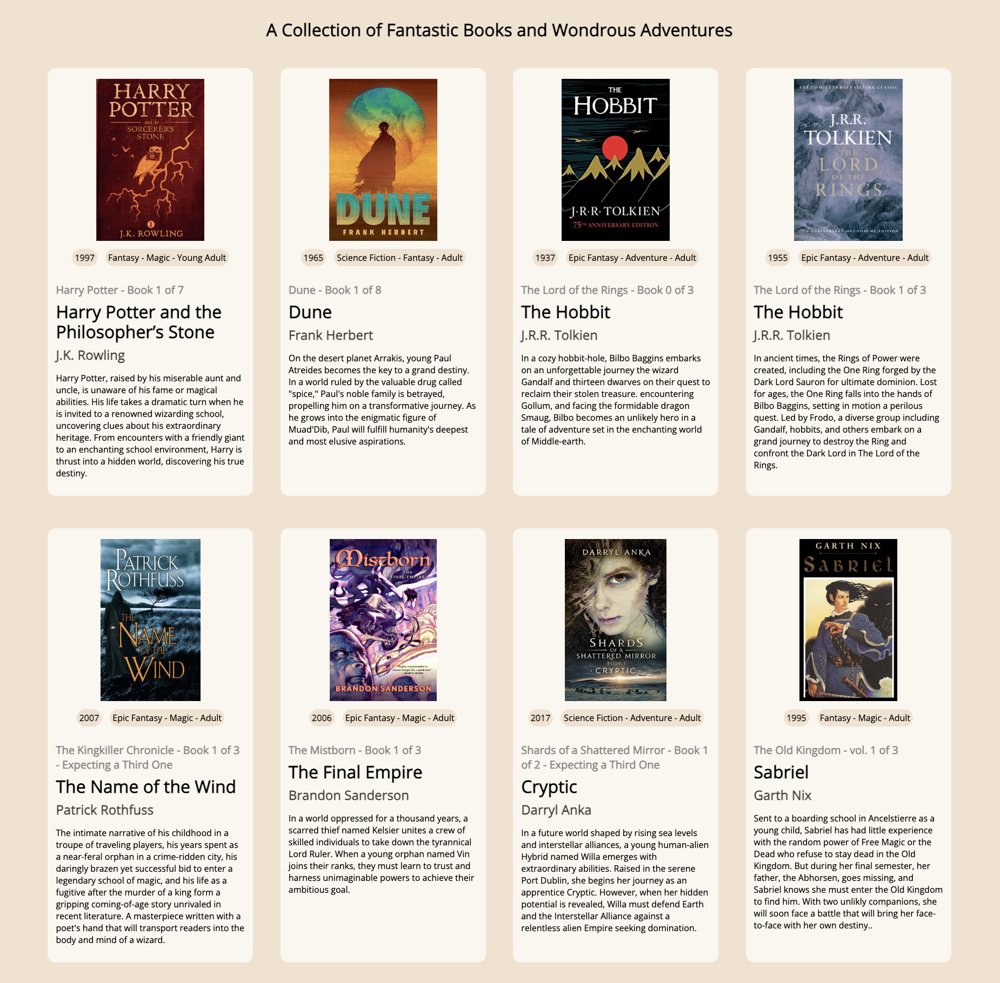

# My Book Collection Exercise

- `Type of Challenge`: learning DOM Manipulation
- `Netlify deployment:` [Visit Now](https://fantastic-book-collection.netlify.app/)

This repository contains a series of beginners exercises destined to practice DOM manipulation. The most interesting among them was the exercise in the folder `3.Collection`, where I created a collection of book cards using JavaScript.

The goal was to gather a list of books and create cards for each book with relevant information. The exercise required me to populate the cards using JavaScript **without using CSS for styling**.

## Challenge Description

The challenge was to create a collection of items based on a chosen topic. I chose "Books" as my topic and proceeded to create a list of 12 Fantasy books. For each book, I gathered relevant information to create cards, including 7 properties per book, such as title, author, year of publication, genre, etc, forming an array of objects. I was then able to create a card for each book using JavaScript and populated the cards with the relevant information.

## Learning Focus: DOM Manipulation

One of the primary objectives of this exercise was to learn and practice DOM manipulation using JavaScript. By dynamically generating and updating the HTML content of the page, I gained a better understanding of how to interact with and modify the structure and content of web pages using JavaScript.

## ⚙️ Technologies

  

## How to Access My Book Collection

My collection of book cards is located in the `3.Collection` folder of this repository, [can be view here](https://fantastic-book-collection.netlify.app/) or glance at just bellow:

 

